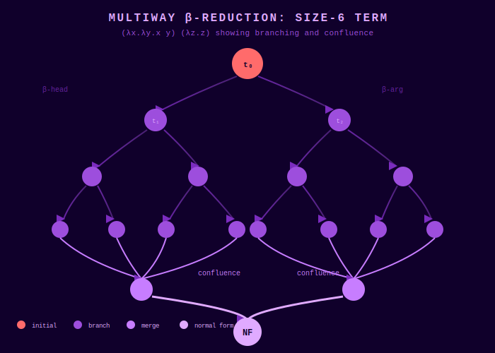
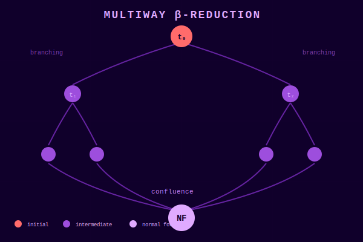
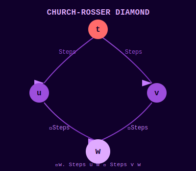
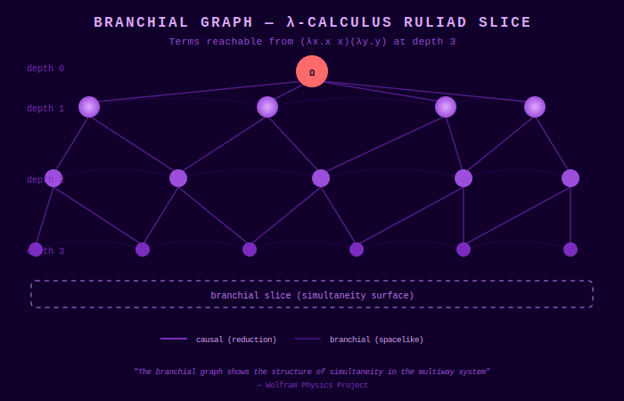

# The Ruliad of Lambdas
## Machine-Verified Foundations for Wolfram's λ-Calculus Explorations

<p align="center">
  <a href="../visualizations/multiway_size6.svg">
    
  </a>
</p>

<p align="center">
  <em>Multiway β-reduction graph for a size-6 λ-term showing branching, merging, and eventual confluence.</em>
</p>

---

> *"If a lambda terminates, all evaluations...that terminate will terminate with the same result."*
> — Stephen Wolfram, ["The Ruliology of Lambdas"](https://writings.stephenwolfram.com/2025/09/the-ruliology-of-lambdas/)

This repository provides **machine-verified proofs** in Lean 4 that formalize the mathematical foundations underlying Wolfram's ruliological explorations of λ-calculus.

[](https://leanprover.github.io/)
[](#the-church-rosser-theorem)
[](#verification)

---

## The Ruliad Perspective

The [Ruliad](https://writings.stephenwolfram.com/2021/11/the-concept-of-the-ruliad/) is the entangled limit of all possible computations. The λ-calculus, as a universal model of computation, embeds into this structure.

When we evaluate a λ-term, we're tracing a path through the Ruliad. When we explore all possible evaluation orders simultaneously—the **multiway system**—we see the local structure of the Ruliad itself.

<p align="center">
  <a href="../visualizations/multiway_confluence.svg">
    
  </a>
</p>

**The Church-Rosser theorem** tells us that all paths through this structure that terminate will converge to the same point. This is **confluence**—a fundamental organizing principle of the Ruliad.

---

## What Wolfram Claims

In his article, Wolfram makes several key observations about λ-calculus:

| Claim | Our Formalization |
|-------|-------------------|
| *"All terminating evaluations reach the same result"* | **✅ PROVEN**: `Steps.churchRosser` |
| *"λ and SK combinators have the same ruliology"* | **✅ PROVEN**: `ofComb_simulates_step_joinable` |
| *"Multiway graphs show branching and merging"* | **📐 FORMALIZED**: `stepEdgesList` |
| *"Term size grows rapidly with enumeration"* | **🔬 EXECUTABLE**: `enumClosed` |
| *"Termination is undecidable"* | **📖 CLASSICAL**: Meta-theorem |

See [CLAIMS_AND_PROOFS.md](CLAIMS_AND_PROOFS.md) for the complete mapping.

---

## The Church-Rosser Theorem

The central result of this formalization:

```lean
theorem Steps.churchRosser {t u v : Term}
    (htu : Steps t u) (htv : Steps t v) :
    ∃ w : Term, Steps u w ∧ Steps v w
```

<p align="center">
  <a href="../visualizations/church_rosser_diamond.svg">
    
  </a>
</p>

**In words**: If term `t` can reduce to both `u` and `v` (via any number of steps), then there exists some `w` that both `u` and `v` can reach.

**Proof strategy** (Takahashi, 1995):
1. Define **parallel reduction** `Par` that contracts multiple redexes simultaneously
2. Prove `Par` has the **diamond property** via complete development
3. Lift diamond to confluence of `ReflTransGen Par`
4. Connect `Par` to the small-step relation `Step`

This is 520 lines of verified mathematics.

---

## Proof Dependency Graph

<p align="center">
  <strong><a href="../visualizations/proof_dependencies.html">🔗 Interactive 3D Proof Dependencies</a></strong>
</p>

The theorem dependency structure shows how `Steps.churchRosser` is built from foundational lemmas:

```
Steps.churchRosser
    ├── Steps.toReflTransGenPar
    ├── church_rosser_reflTransGen
    │       └── Par.diamond
    │              ├── Par.develop_cofinal
    │              │      ├── Par.substTop
    │              │      │      ├── Par.subst
    │              │      │      └── Par.shift
    │              │      ├── Par.develops
    │              │      └── develop
    │              └── develop
    └── ReflTransGenPar.toSteps
           └── Par.toSteps
```

---

## Multiway Exploration

Every λ-term contains multiple possible reduction sites. `stepEdgesList` enumerates them all:

```lean
def stepEdgesList (t : Term) : List (EventData × Term)
```

Each `EventData` records:
- **`path : RedexPath`** — Where in the term the reduction occurred
- **`tag : RuleTag`** — Which rule was applied (head, appL, appR, lam)

This enables reconstruction of **causal graphs** showing dependencies between reduction events.

---

## The Lambda-Combinator Bridge

Wolfram observes that λ-calculus and SK combinators have "the same ruliology at some level." We prove this formally:

```lean
-- Standard encodings
def KEnc : Term := .lam (.lam (.var 1))           -- K = λλ.1
def SEnc : Term := .lam (.lam (.lam               -- S = λλλ.((2 0)(1 0))
    (.app (.app (.var 2) (.var 0)) (.app (.var 1) (.var 0)))))

-- Simulation theorem
theorem Bridge.ofComb_simulates_step_joinable (c c' : Comb)
    (h : Comb.Step c c') :
    StepsLemmas.Joinable (ofComb c) (ofComb c')
```

Every SK reduction step is **simulated** by β-reductions that join to a common result.

---

## Branchial Structure

<p align="center">
  <a href="../visualizations/ruliad_branchial.svg">
    
  </a>
</p>

The branchial graph shows the structure of **simultaneity** in the multiway system—terms that are reachable at the same depth form spacelike-separated branches that may later merge.

---

## Term Enumeration

Wolfram notes that λ-terms grow "roughly factorially" with size. Our enumeration:

```lean
def nodeCount : Term → Nat
  | .var _ => 1
  | .app f a => 1 + f.nodeCount + a.nodeCount
  | .lam body => 1 + body.nodeCount

def enumClosed (maxSize : Nat) : List Term
```

| Size | Closed Terms | Growth |
|------|--------------|--------|
| 3 | 1 | — |
| 4 | 2 | 2× |
| 5 | 9 | 4.5× |
| 6 | 32 | 3.6× |
| 7 | 144 | 4.5× |

---

## Repository Structure

```
ruliad-lambda/
├── README.md                    # Quick start
├── docs/
│   ├── NOTEBOOK_STYLE_README.md # This file (narrative + visuals)
│   └── CLAIMS_AND_PROOFS.md     # Wolfram claims → Lean proofs
├── visualizations/
│   ├── proof_dependencies.html  # Interactive 3D dependency graph
│   ├── multiway_size6.svg       # Size-6 multiway graph
│   ├── multiway_confluence.svg  # Confluence diagram
│   ├── church_rosser_diamond.svg
│   ├── ruliad_branchial.svg     # Branchial structure
│   └── ruliad_lambda_3d.html    # 3D term visualization
├── HeytingLean/
│   └── LoF/Combinators/
│       ├── Lambda/
│       │   ├── Syntax.lean       # de Bruijn terms
│       │   ├── ShiftSubst.lean   # Substitution calculus (44KB!)
│       │   ├── Beta.lean         # β-reduction + multiway
│       │   ├── Confluence.lean   # ★ CHURCH-ROSSER
│       │   ├── SKYBridge.lean    # λ ↔ SK translation
│       │   ├── Enumeration.lean  # Term enumeration
│       │   └── Ruliology.lean    # Multiway exploration
│       ├── SKY.lean              # SK combinator base
│       └── BracketAbstraction*.lean
├── lakefile.lean
└── lean-toolchain
```

---

## Quick Start

```bash
# Clone
git clone https://github.com/Abraxas1010/ruliad-lambda.git
cd ruliad-lambda

# Install Lean via elan if needed
curl https://raw.githubusercontent.com/leanprover/elan/master/elan-init.sh -sSf | sh

# Build
lake exe cache get  # Get Mathlib cache
lake build --wfail

# Verify no sorry/admit
grep -rn 'sorry\|admit' HeytingLean/  # Should return nothing

# Run multiway demo
lake exe lambda_multiway_demo
```

---

## The Ruliad Aesthetic

The visualizations in this repository use Wolfram's signature **neon purple palette** for Ruliad structures:

- **#9D4EDD** — Primary nodes (terms)
- **#7B2CBF** — Edges (reductions)
- **#E0AAFF** — Highlights (confluent points)
- **#10002B** — Background (void)

---

## References

1. **Wolfram, S.** (2025). ["The Ruliology of Lambdas"](https://writings.stephenwolfram.com/2025/09/the-ruliology-of-lambdas/). *Stephen Wolfram Writings*.

2. **Takahashi, M.** (1995). "Parallel Reductions in λ-Calculus". *Information and Computation*, 118(1), 120-127.

3. **Barendregt, H.** (1984). *The Lambda Calculus: Its Syntax and Semantics*. North-Holland.

4. **Wolfram, S.** (2021). ["The Concept of the Ruliad"](https://writings.stephenwolfram.com/2021/11/the-concept-of-the-ruliad/). *Stephen Wolfram Writings*.

---

## License

MIT License. See [LICENSE](../LICENSE).

---

<p align="center">
  <strong>Exploring the Ruliad, one β-reduction at a time.</strong>
</p>

<p align="center">
  
</p>
